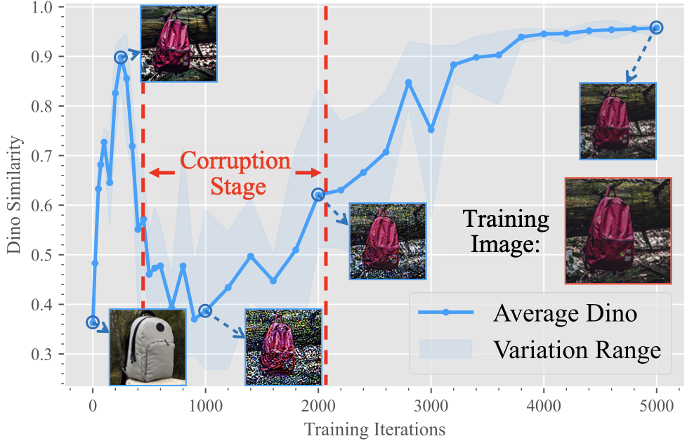
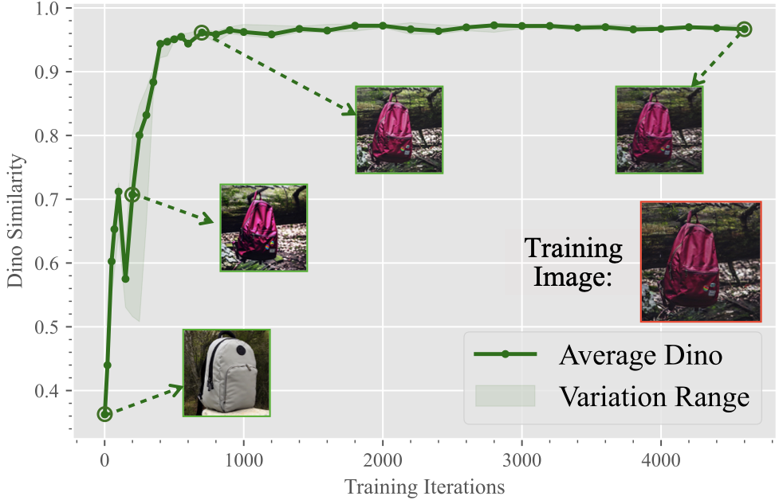

# Exploring Diffusion Models' Corruption Stage in Few-Shot Fine-tuning and Mitigating with Bayesian Neural Networks (KDD 2026)

[](https://arxiv.org/abs/2405.19931)


This repository provides an implementation of **Bayesian Neural Network (BNN)–based fine-tuning for diffusion models**, as proposed in our paper. It is designed to reproduce the key empirical results on mitigating the *corruption stage* observed during few-shot fine-tuning, by applying variational Bayesian training on top of existing personalization methods such as DreamBooth, LoRA, and OFT. The implementation follows the paper setup and introduces no additional inference-time cost.

## 📖 Motivation

During the few-shot fine-tuning of Diffusion Models (DMs), we observed an unexpected phenomenon:
As training progresses, the image fidelity (similarity to training images) initially improves, but then suddenly deteriorates with the emergence of severe **noisy patterns**, before improving again. Ultimately, the model suffers from severe overfitting, generating exact copies of the training images.

We term the phase where generation quality sharply drops and noisy patterns appear as the **"Corruption Stage"**.

<div align="center">
  
  
  <p><em>Left: Image fidelity variation and the corruption stage during traditional few-shot fine-tuning (without BNNs).<br>Right: The fine-tuning process with BNNs, successfully mitigating the corruption stage.</em></p>
</div>

### Why Does Corruption Happen?
To understand this phenomenon, we conducted heuristic modeling starting from the extreme one-shot fine-tuning scenario and extended it to general cases. Our analysis reveals that the root cause of the "corruption stage" is the **narrowed learning distribution inherent in the nature of few-shot fine-tuning**.

### Our Solution: Bayesian Neural Networks (BNNs)
To resolve the constrained distribution issue, we introduce **Bayesian Neural Networks (BNNs)** into diffusion models. By modeling a subset of model parameters as random variables and training them via variational inference, we **implicitly broaden the learned distribution** without directly perturbing or augmenting the input data.

**Key Advantages:**
- 🌟 **Highly Compatible**: Can be seamlessly integrated into current few-shot fine-tuning methods (e.g., DreamBooth, LoRA, OFT).
- 🚀 **Zero Extra Cost**: Introduces absolutely no additional computational or time overhead during inference.
- 📈 **Significant Improvements**: Effectively mitigates the corruption stage while boosting image fidelity, generation quality, and diversity in both object-driven and subject-driven generation tasks.

---

## 🛠️ Requirements

To install the required libraries, execute the following command:

```bash
pip install -r requirements.txt
```

## 🚀 Usage

### Baseline Models
To fine-tune a model using the traditional DreamBooth, LoRA, or OFT methods (without BNNs), run the appropriate script:

```bash
bash run_scripts_baseline_dreambooth/lora/oft.sh
```

### Models with BNNs
To fine-tune a model using our proposed DreamBooth, LoRA, or OFT methods with BNNs, execute the following script:

```bash
bash run_scripts_bayes_dreambooth/lora/oft.sh
```

## 📊 Results
The generated images will be saved in the `logs` directory. We use multiple evaluation metrics to comprehensively measure the model's performance:
- **Clip-I** (Image fidelity)
- **Clip-T** (Text prompt fidelity)
- **Dino**
- **Lpips**
- **Clip-IQA** (Image quality)

For detailed quantitative and qualitative comparisons (including performance across different datasets and ablation studies), please refer to our main paper.

## 📄 License
This project is licensed under the Apache License 2.0.

## 📝 Reference
If you find this repository or our work helpful, please consider citing:

```bibtex
@inproceedings{wu2026exploring,
  title={Exploring Diffusion Models' Corruption Stage in Few-Shot Fine-tuning and Mitigating with Bayesian Neural Networks},
  author={Wu, Xiaoyu and Zhang, Jiaru and Hua, Yang and Lyu, Bohan and Wang, Hao and Song, Tao and Guan, Haibing},
  booktitle={SIGKDD},
  year={2026}
}
```